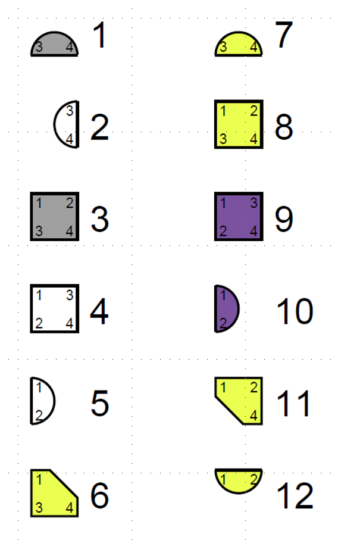
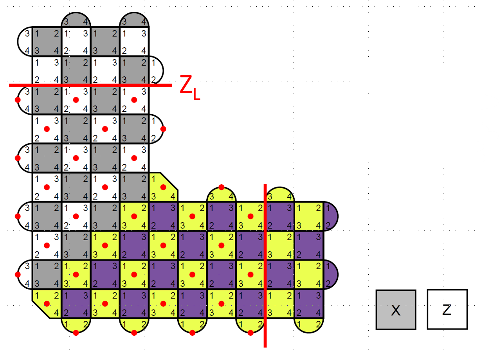

# Move logical qubit

We want to move a logical qubit (encoded using the surface code with distance d)
vertically and horizontally in a larger array of physical qubits.

The description is at the plaquette level.
Each type of plaquette (X or Z stabilizer, with support on 2 or 4 qubits in a specific order)
is associated with an integer code as follows:

For a distance-5 logical qubit moving down by 6 and left by 6, the desired results is:

